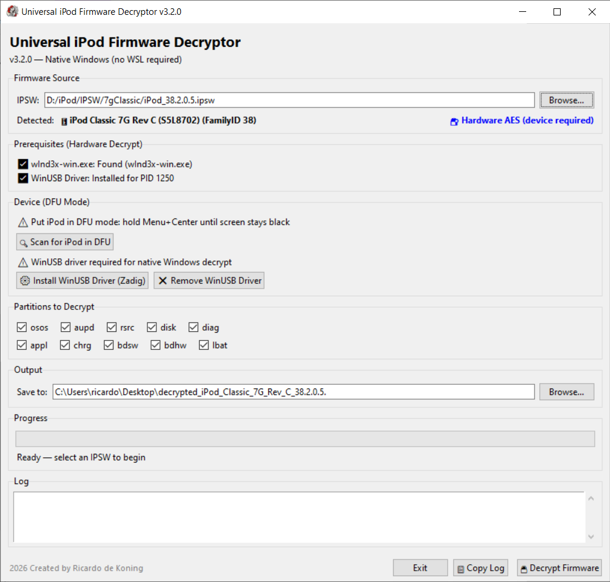

# Universal iPod Firmware Decryptor

Native Windows application for extracting and decrypting iPod RetailOS (OSOS) firmware and exporting plaintext resource files.



**Current source:** v3.2.1 / build 31  
**Latest published executable:** v3.2.0 / build 30  
**Platform:** Windows 10/11  
**Release executable:** See the GitHub Releases page. The `.exe` is intentionally distributed as a release asset, not committed to the source repository.

## Implemented methods

- **Plaintext extraction:** IPSW/MSE extraction with an IMG1-header fallback for unencrypted firmware families.
- **Native hardware AES:** Windows-native `wInd3x-win.exe` haxdfu plus on-device AES for the supported Classic/Nano 3G/4G/5G paths.
- **Legacy hardware AES:** Separate Notes/Loader/Core device-AES transport in `nano2g_device_decrypt.py` and `nano2g_payloads.py`.
- **Nano 5G resource export:** Plaintext RSRC/FAT16 parsing with `SilverImagesDB.LE.bin` export in `nano5g_resources.py`.
- **Historical software reconstruction:** Retained only for forensic comparison; it is not a valid source of ground-truth decrypted firmware.

The current detailed method matrix is documented in `DECRYPTION_METHODS.md`, with build instructions in `BUILD.md` and operational notes in `KNOWLEDGE_BASE.md`.

## Source layout

```text
ipod_universal_decrypt_b.py       Active Tkinter application
nano2g_device_decrypt.py          Native WinUSB legacy device transport
nano2g_payloads.py                Embedded RAM-resident device payloads
nano5g_resources.py               Nano 5G RSRC/FAT16 extraction
DECRYPTION_METHODS.md              Per-model decryption methods
BUILD.md                           Complete source/build instructions
KNOWLEDGE_BASE.md                  Application knowledge base
```

## Runtime dependencies

The native hardware-AES path requires external components that are not committed here:

- `wInd3x-win.exe` from [freemyipod/wInd3x](https://github.com/freemyipod/wInd3x)
- `libusb-1.0.dll` for the native Windows wInd3x build
- WinUSB bound to the target device DFU interface, normally installed with Zadig
- Apple USB services stopped while direct device access is required

The source application can use PyCryptodome, `cryptography`, or OpenSSL for optional historical software-AES comparison code. The active device paths do not expose or require a software copy of the fused AES key.

## Build

The included `BUILD.md` and `iPodUniversalDecrypt_b.spec` use the local `vendor/` directory for external dependencies. A release build can be produced with:

```powershell
python -m PyInstaller --clean --noconfirm iPodUniversalDecrypt_b.spec
```

The executable is published separately as a GitHub Release asset and is excluded from Git by `.gitignore`.

## Safety

The device-side exploit/decryption paths are intended to be RAM-resident. They do not write NAND, NOR, or firmware storage as part of normal extraction/decryption. Resource-only RSRC extraction does not require a connected device.

## Research and limitations

- Nano 4G/5G trampoline paths require direct native Windows USB; USB/IP bridges are unreliable for the intentional timeout/re-enumeration sequence.
- S5Late-era models are not current decrypt-supported targets even if exploit/code-execution experiments exist.
- Category 2 output validation should be strengthened beyond the current file-size gate before treating every output as cryptographic proof.

## Use at your own risk

Universal iPod Firmware Decryptor is experimental reverse-engineering software intended for research, preservation, and firmware analysis. It performs low-level USB communication, may stop Windows Apple-device services, invokes external exploit/decryption tooling, and can upload and execute RAM-resident payloads on compatible devices.

The software is provided without warranty. The author is not responsible for data loss, device malfunction, firmware corruption, security issues, antivirus detections, or any other damage resulting from its use. Review the source code, verify external dependencies, maintain device and data backups, and use an isolated test system where possible.

Microsoft Defender may flag the unsigned PyInstaller executable as `Trojan:Win32/Wacatac.B!ml`. This may be a heuristic false positive caused by the executable's packaging, native USB access, subprocess execution, administrator privileges, and embedded device payloads, but it has not been independently cleared by Microsoft. Users should whitelist or restore the executable at their own risk. Building from source is recommended for users who want to review the implementation directly.
